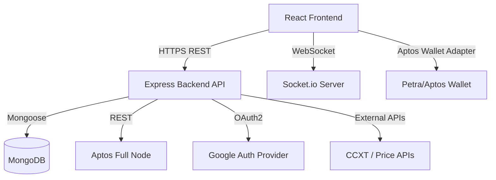

# System Architecture

## Overview
SafeSwap is a decentralized token exchange platform built specifically for the Aptos blockchain. It allows users to securely connect their Aptos wallets, execute token swaps, track market prices, and maintain a robust transaction history. The platform incorporates a unique scam detection layer and provides real-time market updates.

## High-Level Architecture
The system follows a classic decoupled client-server architecture:
- **Frontend (Client):** A single-page application (SPA) built with React.
- **Backend (API Server):** A RESTful Node.js/Express service providing core business logic, database integration, and blockchain interactions.
- **Database:** MongoDB for persistent storage of user profiles, swap history, wallet mappings, and token price caching.
- **Blockchain Node:** Interaction with the Aptos testnet via the `@aptos-labs/ts-sdk`.

## Component Diagram

## Technology Stack

### Frontend
- **Framework:** React 18, Vite
- **Styling:** TailwindCSS, Lucide React (Icons)
- **State Management & Data Fetching:** React Hooks, Axios
- **Web3 Integration:** `@aptos-labs/wallet-adapter-react`, `petra-plugin-wallet-adapter`
- **Real-time:** `socket.io-client`

### Backend
- **Server Environment:** Node.js, Express.js
- **Database Layer:** MongoDB, Mongoose ORM
- **Blockchain SDK:** `@aptos-labs/ts-sdk`
- **Authentication:** Passport.js (Google OAuth2 strategy), JSON Web Tokens (JWT)
- **Real-time:** Socket.io
- **Market Data:** CCXT (Cryptocurrency Exchange Trading Library)

## Core Workflows

1. **Authentication Flow**
   - User clicks "Login with Google".
   - Backend `passport-google-oauth20` verifies identity and creates/fetches a MongoDB `User` record.
   - Backend issues an HTTP-Only Refresh Token (or standard JWTs) and Access Token to the client.
   - Client attaches the Access Token as a Bearer header to subsequent API requests.

2. **Wallet Connection Flow**
   - User triggers the Aptos Wallet Adapter modal on the Frontend.
   - User approves connection in their extension (e.g., Petra).
   - Frontend passes the `address` and `publicKey` to `POST /api/wallet/connect`.
   - Backend verifies the address format and creates/updates a `Wallet` document associated with the `userId`.

3. **Token Swap Flow**
   - User submits a swap request (fromToken, toToken, amount) on the Frontend.
   - The Backend calculates live prices via the Price Feed Service, performs Scam Detection logic, and simulates the Aptos transaction.
   - (In a full Mainnet setup, the actual transaction payload is signed by the client's wallet, but the backend tracks the intent and finalizes the record).
   - A `SwapTransaction` record is saved in MongoDB.
